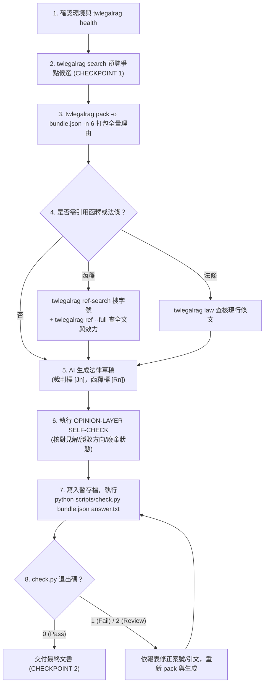

# twlegalrag-search

本技能提供台灣法律法源的完整檢索、效力查驗與確定性引用防護體系，支援 **2,250 萬筆司法裁判、憲法裁判、勞動裁決、78 個中央機關行政函釋／規則，以及全國法規資料庫現行法條**。

當任務需要建立在真實、可追溯、可驗證的台灣法律法源上，而不是憑記憶或未經驗證的法律敘述時，必須使用本技能。

---

## 核心架構：雙模式執行矩陣

為兼顧**法律文書撰寫的極致嚴謹與單一管線性**，以及**日常對話探索時的輕量與彈性**，AI 必須根據任務性質採取對應模式：

| 執行模式 | 適用場景 | 管線策略 | 核心工具 / 指令 | 引用標記與驗收機制 |
|---|---|---|---|---|
| **【模式 A】法律文書撰寫模式** | 起草訴訟書狀、法律意見書、爭點整理表等正式法律文本 | **★ 統一 CLI 管線**<br>（消除協議切換混亂，全流程本地留痕） | • 裁判：`twlegalrag pack`<br>• 函釋：`twlegalrag ref --full`<br>• 法條：`twlegalrag law`<br>• 驗收：`scripts/check.py` | • 裁判標記 `[J1]`、`[J2]`...；以 `allowed_citations` ＋ `scripts/check.py` 退出碼驗收。<br>• 函釋標記 `[R1]` 或全稱字號；核驗 `status` ＋ 主旨說明全文。 |
| **【模式 B】即時法律研究與探索模式** | 日常對話中探討爭點、快速驗證法條或函釋效力（無需產出正式檔案） | **★ 輕量雙軌相容**<br>（MCP 優先即問即答；無 MCP 則由 CLI 無縫接管） | • MCP：`get_legal_reference`、`get_law_article`、`search_judgments`<br>• CLI：`twlegalrag ref`、`twlegalrag law`、`twlegalrag search` | • 即時呈現法源要點與效力狀態。<br>• 不產生本地暫存檔。 |

---

## 指令與工具調用手冊

### 1. CLI 指令規範（全功能覆蓋）

所有 CLI 指令直接使用 Python 執行，確保終端編碼為 UTF-8：

```bash
# 服務健康度確認
twlegalrag health

# 1. 司法裁判：探索預覽與封包打包
twlegalrag search "<查詢詞>" -n 5 --read
twlegalrag pack "<爭點問題>" -o bundle.json -n 6

# 2. 行政函釋：語義檢索與全文調卷
twlegalrag ref-search "<查詢詞>" -n 5 [--authority "<機關>"] [--kind "<類型>"] [--excerpt]
twlegalrag ref "<發文字號>" [--authority "<機關>"] [--full]

# 3. 現行法條：精確查核條文原文與修正日期
twlegalrag law "<法規名稱或常用縮寫>" "<條號>"

# 4. 引用防偽驗收：確定性比對答案與 bundle
python scripts/check.py <bundle.json> <answer.txt>
```

- **環境前置檢查**：確認執行環境可使用 `twlegalrag` 指令。若未安裝或無法執行，提示使用者安裝：`pip install twlegalrag`。
- **查詢筆數與升級策略**：
  - `twlegalrag search` 預設使用 `-n 5`，用於快速確認檢索方向與候選相關性。
  - `twlegalrag pack` 預設顯式帶入 `-n 6`，優先取得精簡之核心裁判集合。v2.1+ 自動處理長判決分頁（單篇上限 12,000 字），並包含 `hit_excerpt` 與 `fulltext_total_chars`。
  - `twlegalrag ref-search` 預設使用 `-n 5`。
  - 若法律爭點較廣、結果分散或最高法院裁判不足，才逐步提高至 `-n 8` 或 `-n 10`。
- **`ref --full`**：加上 `--full` 印出主旨、說明與法規全文。
- **`law`**：支援全名（`民法`）與常用縮寫（`勞基法`、`刑法`、`消保法`）；若查無會回傳法規名稱候選。僅收錄現行整編版本，修法前舊法（行為時法）請至官方沿革查詢。
- **`scripts/check.py` 退出碼門禁**：
  - **`0`**：通過（pass）
  - **`1`**：不通過（fail，偵測到不在 bundle 內的字號，高度疑似捏造）
  - **`2`**：待人工複核（needs_review，字號在 bundle 內但引文存在性未完全吻合）

### 2. MCP 工具規範（即時探索模式使用）

當環境掛載 `tw-legal-rag` MCP 服務時，可於【模式 B】調用：
- `search_judgments(query=..., max_results=5)`：裁判清單快速預覽。
- `search_bundle(query=..., max_results=5, read_top=5)`：遠端裁判打包（務必顯式傳入 `read_top`）。
- `search_legal_references(query=..., authority=..., source_kind=..., max_results=5)`：函釋語義探索。
- `get_legal_reference(serial=..., authority=...)`：函釋全文調卷與 `status` 效力查驗。
- `get_law_article(law_name=..., article_no=...)`：現行法條查詢。

---

## 法源性質辨識與引用規則

AI 在處理檢索結果時，**必須嚴格辨識法源性質，恪守對應之引用規範與禁令**：

| 法源類型 | 識別特徵 / 字號格式 | 性質與效力說明 | 引用規範與禁令 |
|---|---|---|---|
| **憲法裁判 / 大法官解釋** | `憲判字`、`釋字第 N 號` | 具拘束全國各機關及人民之最高憲法效力。 | 標記 `[Jn]`。引用格式為「司法院釋字第 N 號」或「憲法法庭 OOO 年憲判字第 N 號」。 |
| **法院裁判** | 各級法院裁判字號（如 `最高法院 112 年度台上字第 9 號`） | 司法審判實務見解，依審級具實質影響力與前例價值。 | 標記 `[Jn]`。嚴格遵守下述 §法院審級優先順序。 |
| **行政函釋／命令** | 部會發文字號（如 `勞動條 3字第1150148315號函`、`台財稅第...號`） | 主管機關內部之解釋性規定與裁量基準（行政程序法 §159），供執法參考，對法院無拘束力。 | 標記 `[Rn]` 或全稱引述。🔴 **嚴禁稱為「法院見解」或「判決」**。引用前**必須調閱全文並核對效力**。 |
| **不當勞動行為裁決** | 裁決字號（如 `112年勞裁字第...號`，`doc_id` 開頭為 `arb:`） | 勞動部裁決委員會之行政救濟裁決，**非司法裁判**。 | 標記 `[Jn]`。🔴 **嚴禁稱為「判決」或「法院見解」**，必須明確標示為「勞動部不當勞動行為裁決委員會見解」。 |
| **現行法條** | 法規名稱 ＋ 條號（如 `民法 第184條`） | 國家制定公布之成文法。 | 引用條文前先以 `law` 核對文字。🔴 **本工具僅提供現行版本**，行為時法（舊法）應至沿革系統複核。 |

---

## 法院審級優先順序規則

在檢索、整理與引用**法院裁判**時，依下列順序優先處理：
1. **最高法院 / 最高行政法院裁判優先**。
2. 其次為**臺灣高等法院及其分院裁判**。
3. 若前述裁判不足以支撐爭點，再補充地方法院裁判。

當多筆裁判均與爭點相關時，依法院層級由高至低排序；若最高法院見解已足以支撐核心論證，不得堆砌下級審重複見解。

---

## 查詢詞建構原則

1. **司法裁判語義查詢**：「法律構成要件關鍵字 ＋ 法律效果關鍵字」（例：`競業禁止 代償措施 實質補償`、`定期租賃 終止 拒絕返還`）。
2. **裁判字號精確調卷與簡寫正規化**：
   - 標準案號（`最高法院 112年度台上字第9號`）或純短案號（`112台上9`、`108台上大2470`）可直接查詢。
   - 🔴 **口語雙重簡寫正規化**：若使用者輸入「法院簡稱＋短案號」（如 `北院 112訴100`、`最高院 112台上100`），**AI 必須主動正規化為標準案號**（`臺灣臺北地方法院 112年度訴字第100號` 或純短案號 `112訴100`），避免後端正則失效。
3. **行政函釋查詢**：提煉「主管機關權責事項 ＋ 爭議要件」（例：`扣繳義務人 未依限申報 處罰`），並善用 `--authority`（如 `財政部`、`勞動部`）。
4. **概念擴展禁令**：嚴禁跨越法律效果邊界（終止 ≠ 解除；解除 ≠ 撤銷；無效 ≠ 撤銷）。
5. **正反雙向查證原則**：檢索支持主張之案例時，必須同時檢索反向關鍵字（`駁回`、`敗訴`、`不予准許`），全面評估訴訟風險。

---

## 標準作業流程（SOP）

### SOP 流程 A：法律文書起草標準流程（統一 CLI 管線）

當使用者要求撰寫起訴狀、答辯狀、準備書狀或法律意見書時，**一律執行本流程**：



1. **環境與服務確認**：確認環境具備 `twlegalrag` 指令（若無提示 `pip install twlegalrag`），執行 `twlegalrag health`。
2. **預覽確認**：執行 `twlegalrag search "<查詢詞>" -n 5 --read` 預覽候選。
   > 🔴 **CHECKPOINT 1 — 方向與候選確認**：展示裁判字號、審級與案由。若同案號存在民事/刑事多文書，嚴格核對 `case_category`。
3. **全量打包**：執行 `twlegalrag pack "<爭點問題>" -o bundle.json -n 6`。
4. **函釋／法條查驗（若需要）**：
   - 函釋：執行 `twlegalrag ref-search "<爭點>"` 鎖定字號，**強制執行 `twlegalrag ref "<字號>" --full` 讀取完整主旨說明與 `status`**。
   - 法條：執行 `twlegalrag law "<法規>" "<條號>"` 確認最新文字。
5. **草稿撰寫**：
   - 裁判標註 `[J1]`、`[J2]`...，論理必須嚴格出自 `fulltext_excerpt`，排除 `case_history` 顯示已廢棄之裁判。
   - 函釋標註 `[R1]` 或全稱字號，註明發布機關、發文字號與有效狀態。
6. **見解層自查（OPINION-LAYER SELF-CHECK）**：
   - 作答後逐一回頭核對：
     (a) 歸給某判決的見解確實出現在該判決的 `fulltext_excerpt` 原文中（非推論或別篇見解）；
     (b) 裁判結果方向（勝訴／敗訴／廢棄／駁回／發回）沒有顛倒；
     (c) `case_history` 顯示已被廢棄之裁判，不得當成現行有效見解引用。
7. **引用防偽驗收**：將生成內容寫入暫存文字檔，執行：
   ```bash
   python scripts/check.py bundle.json answer.txt
   ```
   > 🔴 **CHECKPOINT 2 — 驗證門禁確認**：必須獲得 Exit code 0（整體 通過）始得交付。若為 1 或 2，必須回頭修正引文與案號。

---

### SOP 流程 B：對話中即時研究與探索流程（雙軌相容）

當使用者在對話中詢問法律問題、請益實務見解或要求查核特定字號（非生成正式文書）時：

1. **裁判探索**：
   - 有 MCP：調用 `search_judgments` 快速列出候選。
   - 無 MCP：執行 `twlegalrag search "<詞>" -n 5`。
2. **函釋查驗（二階段強制流程）**：
   - 第一階段（探索）：調用 `search_legal_references` 或執行 `twlegalrag ref-search`。
   - 第二階段（調卷與效力查驗）：**強制調用 `get_legal_reference` 或執行 `twlegalrag ref "<字號>" --full`**。
   - **效力狀態機處置規則**：
     - 🟢 `status == "valid"` / `"active_verified"`：現行有效，可採為實務見解。
     - 🔴 `status == "repealed"` / `"ceased"` / `"replaced"`：**嚴禁引為現行依據**（僅能作歷史沿革說明）。
     - 🟡 `status == "unknown"`：資料庫尚未自動驗證，引用時必須明示「效力尚未經系統自動驗證，適用時請向主管機關複核」。
3. **法條查驗**：調用 `get_law_article` 或執行 `twlegalrag law "<法規>" "<條號>"`，提供現行條文全文與最後修正日期。

---

## 輸出格式規範

使用本技能輸出正式法律分析或書狀時，應包含以下區塊：
1. **法律爭點與檢索策略**：列出爭點、查詢詞與查證管道。
2. **一、 司法審判實務見解**：標註 `[Jn]`、裁判字號、審級歷程（維持/廢棄）、理由核心摘要、`check.py` 驗收結果。
3. **二、 主管機關行政函釋與行政規則**：標註 `[Rn]` 或完整字號、發布機關、發文日期、`status` 效力查驗結果、核心解釋意旨（含適用要件與但書）。
4. **三、 適用法條依據**：法規名稱、條號、現行條文內容、最後修正日期。

---

## 失敗處理

| 觸發條件 | 一線修復 | 仍失敗兜底 |
|---|---|---|
| 裁判字號精確調卷查無結果 | 1. 檢查字號拼寫與合法格式（更審 `更一`、大法庭 `台上大`）。<br>2. 留意法定不公開案件（兒少、性侵）或新宣判之入庫時間差。 | 告知「查無不代表不存在，但因資料庫未收錄，不得臆測該案內容」，建議至司法院法學資料檢索系統確認，停止引用。 |
| 環境無 MCP 連線 | 自動切換為 CLI 指令（`twlegalrag ref-search` / `ref --full` / `law`）。 | 保證 100% 本地可用，無需向使用者報錯中斷。 |
| `law` 查無法規或條號 | 核對回傳之 `law_candidates` 候選法規清單，改用精確名稱重查。 | 告知查無該條文，提醒確認是否為已廢止法規或條號異動。 |
| `ref` 查無指定函釋字號 | 核對字號全半形、臺/台、「字第」/「第」等變體重查。 | 告知查無此字號，嚴禁宣稱該字號為捏造，停止引用該函釋。 |
| `ref` 顯示 `status` 為 `repealed` / `ceased` | 檢視 `superseded_by` 尋找取代之新令函。 | 嚴禁作為現行依據引用；若為沿革說明，必須明確標記「已廢止／停止適用」。 |
| `scripts/check.py` 回傳 1 (Fail) 或 2 (Review) | 依報表修正 `[Jn]` 標記，核對 `fulltext_excerpt` 原文修正引文。 | 重新執行 `pack` 更新 bundle，修正草稿後再次驗證直至 code 0。 |
| `case_history` 顯示裁判已被廢棄 | 尋找更審後之最新裁判，或改用其他未廢棄之最高法院裁判。 | 僅能在說明訴訟歷程時引用，不得當作現行有效前例。 |

---

## 規則（絕對禁止事項）

- 🔴 **絕對禁止捏造**裁判字號、發文字號、裁判理由、函釋內容或法條文字。
- 🔴 **絕對禁止性質混淆**：嚴禁將行政函釋或勞動裁決稱為「法院判決」或「判例」。
- 🔴 **絕對禁止引用已廢棄裁判或已廢止函釋**作為現行有效前例。
- 🔴 **絕對禁止將 `hit_excerpt` 作為逐字引述依據**（必須以 `fulltext_excerpt` 或 `ref --full` 全文為準）。
- 🔴 **絕對禁止跳過全文查核**：嚴禁僅憑 `ref-search` 摘要直接引用函釋，必須經 `ref --full` 或 `get_legal_reference` 調閱全文。
- 🔴 **絕對禁止跳過書狀驗收門禁**：產出訴訟書狀或意見書時，未經 `scripts/check.py` 驗收（Exit code 0）嚴禁交付。
- 🔴 **絕對禁止將現行法條直接當作行為時法**：遇跨越修法年份之案件，必須提醒使用者核對歷史沿革條文。
- 🔴 **絕對禁止繞過依賴**：若 CLI 未安裝或服務不可用，嚴禁自行改用未經驗證之網頁爬蟲或 HTTP 請求替代。

---

## 範例

### 範例 1：準備書狀起草（統一 CLI 管線）
* **需求**：撰寫勞資爭議準備書狀，主張雇主未給付特休未休工資及加班費。
* **流程**：
  1. 確認 `twlegalrag` 可用，執行 `twlegalrag health` 確認服務。
  2. `twlegalrag search "特休未休工資 加班費" -n 5 --read`（CHECKPOINT 1 確認方向）。
  3. `twlegalrag pack "特休未休工資請求權與加班費計算" -o bundle.json -n 6`。
  4. `twlegalrag ref-search "特別休假 未休日數 工資發給" --authority "勞動部"` → 取得候選 `勞動條 2字第1080130382號令`。
  5. `twlegalrag ref "勞動條2字第1080130382號" --full` → 確認 `status: active_verified`，讀取主旨與說明。
  6. `twlegalrag law 勞基法 38` → 核對特別休假現行條文。
  7. AI 起草書狀，裁判標 `[J1]`、`[J2]`，函釋標 `[R1]`，法條列於依據法規。
  8. 執行 OPINION-LAYER SELF-CHECK 核對見解原文與勝敗方向。
  9. 寫入 `pleading_draft.txt`，執行 `python scripts/check.py bundle.json pleading_draft.txt`。
  10. 確認 Exit code 0，交付書狀（CHECKPOINT 2）。

### 範例 2：對話中即時法源查證（雙軌相容）
* **需求**：請幫我查財政部關於建物管理維護契約是否應貼印花稅票的規定。
* **流程**：
  1. 調用 MCP `search_legal_references(query="建物管理維護契約 印花稅", authority="財政部")`（或無 MCP 時執行 `twlegalrag ref-search "建物管理維護契約 印花稅" --authority "財政部"`）。
  2. 鎖定字號 `台財稅第881945861號`。
  3. 調用 MCP `get_legal_reference(serial="台財稅第881945861號")`（或執行 `twlegalrag ref "台財稅第881945861號" --full`）。
  4. 確認 `status: active_verified`，提取主旨說明「清潔維護契約兼具承攬契據性質應貼花，警衛安全業務非屬承攬性質免貼花」。
  5. 即時回覆使用者，註明發布機關、發文字號與有效狀態，說明此為行政主管機關令函。